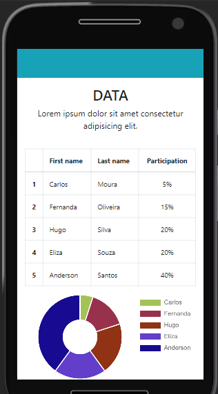
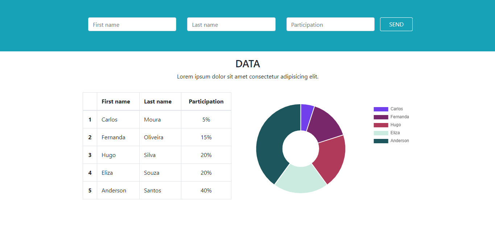

# Front-End and Back-End Integration

## Demonstration

 

 
## 📋 About the project

- Criação de APIs que enviam e recebam informações de um formulário, integrando em uma tabela com informações de percentual de participação e um gráfico de doughnut que representa essa distribuição.

## Available Scripts
No diretório do projeto, você pode executar: 
`npm start` 
Execute o app no modo de desenvolvimento. 
Abra http://localhost:3000 para visualizá-lo no navegador.

## 💻 Techs

* [ ] Node.js
* [ ] Express.js
* [ ] Bootstrap
* [ ] Chart.js

## Author

**Douglas D. Santos**

Encontre-me em [?&style=for-the-badge&logo=gmail&logoColor=white)](mailto:douglas.d.santos.dev@gmail.com) [.svg?&style=for-the-badge&logo=linkedin&logoColor=white)](https://www.linkedin.com/in/douglas-santos-8442b41ba/)

## 📕 License

Esse projeto está sob a licença MIT.
 
